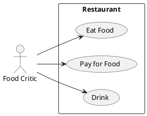

# Описание требований и архитектуры

## Введение
<!-- Общее краткое описание создаваемой системы -->
В рамках курса осуществляется проектирование решения на основе [постановки задачи от "заказчика"](../../task.md).

- [Описание требований и архитектуры](#описание-требований-и-архитектуры)
  - [Введение](#введение)
  - [Заинтересованные стороны](#заинтересованные-стороны)
  - [Бизнес-контекст (бизнес-требования)](#бизнес-контекст-бизнес-требования)
  - [Глоссарий](#глоссарий)
  - [Модель предметной области](#модель-предметной-области)
  - [Требования к системе](#требования-к-системе)
    - [Сценарии использования (Use case)](#сценарии-использования-use-case)
    - [Функциональные требования](#функциональные-требования)
    - [Бизнес метрики](#бизнес-метрики)
    - [Нефункциональные требования/Требования к атрибутам качества](#нефункциональные-требованиятребования-к-атрибутам-качества)
    - [Алгоритмы мониторинга](#алгоритмы-мониторинга)
    - [Ограничения](#ограничения)
  - [Архитектура](#архитектура)
    - [Журнал архитектурных решений](#журнал-архитектурных-решений)
    - [Контекст решения](#контекст-решения)
    - [Компонентная архитектура](#компонентная-архитектура)
    - [Реализация сценариев использования](#реализация-сценариев-использования)
    - [Программные интерфейсы](#программные-интерфейсы)
    - [Схема развертывания](#схема-развертывания)
  
## Заинтересованные стороны
<!-- Перечень заинтересованных сторон и их интересов по отношению к создаваемой системе. 
Подробнее: https://confluence.mts.ru/pages/viewpage.action?pageId=399975538 
-->
| Заинтересованная сторона | Интересы           |
|:-------------------------|:-------------------|
| Организаторы             | Успешное проведение конференции, стабильная работа систем, затраты на разработку, сроки разработки |
| Докладчики               | Регистрация на конференцию, получение обратной связи, участие в конференции      |
| Рецензенты               | Проверка докладов, возможность обратной связи |
| Администраторы           | Работа с докладами, работа с рецензентам, составление календаря конференции |
| Слушатели                | Участие в конференции в качестве слушателя, стабильная работа трансляции, возможность посмотреть архив конференций |
| Разработчики             | Разработка всего функционала в срок, стабильная работа систем |
| Инженеры эксплуатации    | Стабильная работа систем, безопасность проведения конференеции |

## Бизнес-контекст (бизнес-требования)
<!-- Общее описание бизнес-контекста создаваемой системы (автоматизируемой деятельности), список бизнес-целей заинтересованных сторон 
Подробнее: https://confluence.mts.ru/pages/viewpage.action?pageId=399973845
-->

1. Нужно иметь возможность принимать заявки на участие в конференции от докладчиков
2. Поступающие доклады должны проходить рецензию, автору доклада необходимо предоставить обратную связь после рецензирования независимо от результата в установленные сроки.
3. Нужно иметь возможность скомпоновать программу конференции из отобранных докладов
4. Нужно иметь возможность просматривать конференцию в онлайн формате на сайте https://helloconf.mts.ru
5. Для слушателей нужно реализовать возможность  оставить обратную связь для каждого доклада
6. Доклады и материалы к ним должны быть доступны для просмотра на сайте после проведения конференции

## Глоссарий
<!-- Содержит основные понятия и термины предметной области  
Подробнее: https://confluence.mts.ru/pages/viewpage.action?pageId=375782595
-->
| Понятие               | Определение                       |
|:----------------------|:----------------------------------|
| Конференция           | Собрание групп лиц для обсуждения определённых тем |
| Автор                 | Участник конференции, выступающий по определенной теме |
| Доклад                | Подготовленное выступление по определенной теме |
| Пользователь системы  | Пользователь ИС с определенной ролью, позволяющей выполнять определенные для этой роли операции  |
| Программа конференции | Список выступлений конференции с указанием даты старта и даты окончания каждого доклада |
| Отзывы                | Обратная связь по докладам |

## [Модель предметной области](data/data.md)

## Требования к системе

### Сценарии использования (Use case)
<!-- Подробное описание сценариев использования системы с привязкой к ролям участников и задействованным бизнес-сущностям 
https://confluence.mts.ru/pages/viewpage.action?pageId=375782108 
https://confluence.mts.ru/pages/viewpage.action?pageId=375782119 
-->
#### Диаграмма сценариев использования (Use Case Diagram) <!-- omit in toc -->

#### Список сценариев использования <!-- omit in toc -->

| ID     | Описание                                          |
|--------|---------------------------------------------------|
| UC.001 | *[Название сценария использования](uc/uc.001.md)* |

### Функциональные требования
<!-- Описание требований к функциям, реализуемым системой. Требование может быть привязано к сценарию использования или быть общим 
Подробнее: https://confluence.mts.ru/pages/viewpage.action?pageId=375782501 
-->
| ID     | Система должна позволять              |
|--------|---------------------------------------|
| FR.001 | Администратору заводить новые конференции |
| FR.002 | Администраторам видеть список докладов с их статусами |
| FR.003 | Администраторам видеть список авторов докладов |
| FR.004 | Администраторам видеть список докладов автора по всем конференциям системы с  их статусами |
| FR.005 | Администраторам назначать рецензентов на доклад |
| FR.006 | Рецензенту получать уведомление о назначенном докладе с указанием сроков рецензирования |
| FR.007 | Рецензенту оставлять обратную связь по докладу |
| FR.008 | Администраторам получать уведомления о затянувшемся процессе рецензирования |
| FR.009 | Администраторам составлять расписание конференции из подтвержденных докладов |
| FR.010 | Докладчику иметь возможность указать свои контактные данные и загрузить материалы по докладу для выбранной конференции|
| FR.011 | Посетителю сайта видеть список будущих конференций |
| FR.012 | Посетителю сайта видеть список прошедших конференций |
| FR.013 | Посетителю сайта просматривать доклады и скачивать материал по докладам из прошедших конференций|
| FR.014 | Посетителю сайта регистрироваться для участия в конференции в качестве слушателя |
| FR.015 | Отправлять уведомления с напомининаем о конференеции зарегистрированным слушателям  |
| FR.016 | Посететилям сайта смотреть конференцию в онлайн формате  |
| FR.017 | Слушателю доклада оставлять обратную связь по просматриваемому докладу |
| FR.018 | Администраторам видеть отзывы по каждому докладу |

### Бизнес метрики

1. Количество присланных докладов в рамках одной конференции
2. Процент докладов прошедших рецензию в рамках одной конференции
3. Процент докладов выбранных для участия в конференции
4. Сроки рассмотрения доклада
5. Количество зарегистрированных слушателей конференции
6. Количество просмотров онлайн трансляции 
7. Количество пользователей онлайн в момент трансляции
8. Количество просмоторов/скачиваний докладов после проведения конференции
9. Самые популярные и менее популярные доклады по обратной связи

### Нефункциональные требования/Требования к атрибутам качества
<!-- Требования к основным архитектурным характеристикам (атрибутам качества) системы - надежность, масштабируемость, ИБ, и др.
Подробнее: https://confluence.mts.ru/pages/viewpage.action?pageId=375782530
-->
| ID     | Атрибут качества     | Описание требования                               | Мониторинг  |
|--------|----------------------|---------------------------------------------------|-------------|
| QR.001 | Производительность   | В системене могут одновременно работать не менее 50 пользователей с правами администратор и ревьювер  | Prometheus, Grafana |
| QR.002 | Производительность   | Система должна обеспечивать стабильную трансляцию для 2000 онлайн в момент трансляции | Prometheus, Grafana |
| QR.003 | Производительность   | Система должна позволять регистрироваться и загружать свои доклады  не менее 10 авторам в минуту | Prometheus, Grafana |
| QR.004 | Производительность   | Система должна позволять оставлять обратную связь по докладам не менее 1000 запросов в секунду | Prometheus, Grafana |
| QR.005 | Производительность   | Время обработки запроса на сохранение обратной связи не должно превышать 2 секунды | Prometheus, Grafana |
| QR.006 | Доступность          | Доступность системы в момент проведения конференции 99% и 97% во все остальное время  | Zabbix |
| QR.007 | Надежность           | Для информационной системы должно быть обеспечено георезервирование  | |
| QR.008 | Надежность           | Переключение на другой дата центр должно просходить не более чем за 5 минут | Замеры времени переключения при приемке системы |
| QR.009 | Безопасность         | Персональные данные пользователей системы и участников конференции должны быть защищены | Выполнение всех требований безопасности, периодическое проведение тестов безопасности |
| QR.010 | Масштабируемость     | Должна быть реализована возможность увеличивать производительность системы за счет горизонательного масштабирования | Тесты при приемке системы |
| QR.011 | Масштабируемость     | Развертывание дополнительного инстанса любого компонента системы не должно превышать 10 минут | Тесты при приемке системы |

### Алгоритмы мониторинга

### Ограничения
<!-- Описываются ограничения, оказывающие влияние на архитектуру системы - временные, финансовые, технологические
Подробнее: https://confluence.mts.ru/pages/viewpage.action?pageId=375782592
-->
| ID     | Ограничение            |
|--------|------------------------|
| AC.001 | *Описание ограничения* |

## Архитектура

### Журнал архитектурных решений
<!-- Записи о ключевых принятых архитектурных решениях (ADR) для реализации архитектурно-значимых требований.
Подробнее: https://confluence.mts.ru/pages/viewpage.action?pageId=421162308
-->
- [ADR.NNN Суть решения](adr/adr-template.md)

### [Контекст решения](context/context.md)

### [Компонентная архитектура](components/components.md)

### Реализация сценариев использования
<!-- Реализация сценариев использования на основе взаимодействия компонентов системы и внешних систем/участников.
Диаграммы последовательности (UML Sequence diagram) и текстовое описание.

Подробнее: 
https://confluence.mts.ru/pages/viewpage.action?pageId=399442132
https://confluence.mts.ru/pages/viewpage.action?pageId=399442170
-->
| ID     | Описание                          | Реализация                                    |
|--------|-----------------------------------|-----------------------------------------------|
| UC.001 | *Название сценария использования* | [Реализация сценария](uc-impl/uc.001-impl.md) |

### Программные интерфейсы
<!-- Спецификации публичных API системы и ее компонентов (синхронных, событийных). Создается на основе модели предметной области для реализации сценариев использования. 
  Форматы: OAS/Swagger, GraphQL, AsyncAPI/CloudEvents
-->
| Компонент             | Интерфейс                                      |
|:----------------------|:-----------------------------------------------|
| *Название компонента* | *[Название интерфейса](api/service-name.yaml)* |

### [Схема развертывания](deployment/deployment.md)
